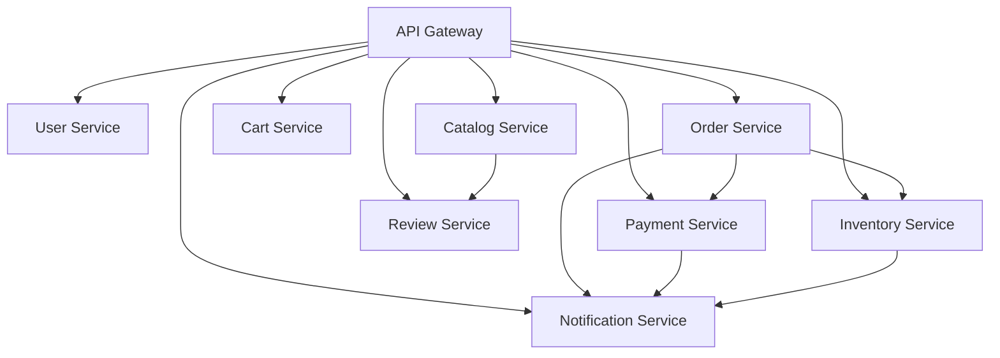

# super-utils

super-utils is a portable, web-based debugging and network toolkit built with Go (Fiber) and HTMX. It allows you to run a wide range of system, network, and diagnostic tools from any browser, with a modern UI and easy deployment via Docker or Helm.

## Overview

This project serves dual purposes:

1. **Network Toolkit**: A comprehensive web-based debugging and network diagnostic platform
2. **Microservices Emulator**: A book shop microservices architecture emulator for testing and development

The toolkit provides instant access to essential system utilities through a browser interface, while the emulator allows developers to simulate and test microservices architectures without deploying full infrastructure.

## Features

### Network & System Diagnostics

- **Run System & Network Tools:** Execute commands like `ping`, `tcpdump`, `nmap`, `curl`, `traceroute`, `iperf`, and many more directly from the web UI.
- **Curl & GraphQL:** Test HTTP endpoints and GraphQL queries interactively.
- **Network Info:** Lookup IP addresses, host details, and network information.
- **Single-File HTMX UI:** Lightweight, fast, and easy to use. The UI is embedded in the Go binary for portable execution.

### Microservices Emulator

- **Book Shop Architecture:** Simulates a complete book shop microservices ecosystem
- **Service Management:** Start, stop, and monitor individual microservices
- **Service Discovery:** Built-in service registry and API gateway
- **Interactive Testing:** Test service interactions and dependencies
- **Development Ready:** Perfect for local development and testing

### Deployment & Integration

- **Docker & Helm Support:** Deploy anywhere, from local dev to Kubernetes clusters.
- **Multi-Architecture:** Supports both AMD64 and ARM64 platforms
- **Extensible:** Add more tools easily by updating the Dockerfile and UI dropdown.
- **Cloud Integration:** Built-in support for cloud tools (gsutil, mysqldump, etc.)

## Supported Tools

super-utils includes a comprehensive set of CLI/network utilities (all available in the Docker image and UI):

### Network & Diagnostic Tools

apache2-utils, arping, bash, bind-tools, bird, bridge-utils, busybox, busybox-extras, calicoctl, conntrack-tools, ctop, curl, dhcping, drill, ethtool, file, fping, httpie, iftop, iperf, iperf3, iproute2, ipset, iptables, iptraf-ng, iputils, ipvsadm, liboping, mii-tool, mtr, net-snmp-tools, netcat-openbsd, netgen, nftables, ngrep, nmap, nmap-nping, scapy, socat, strace, tcpdump, tcptraceroute, termshark, tshark, websocat

### File & Text Processing

awk, cut, diff, find, grep, sed, vi, vim, wc, gzip, cpio, tar, jq

### System & Development

bash, git, libc6-compat, openssl, py-crypto, py2-virtualenv, python2, python3, util-linux

### Web & Transfer Tools

curl, wget, dig, nslookup, telnet, ssh, lftp, rsync, scp, ab (ApacheBench)

### Database Clients

mysql-client, postgresql-client, mongodb-tools, redis

## Quick Start

### Local Development

```bash
# Install dependencies
cd super-utils
go mod tidy
go run main.go
# Open http://localhost:8080 in your browser
```

### Docker

```bash
docker run -p 8080:8080 super-utils
# All tools are available inside the container

docker pull quay.io/pepodev/super-utils

# mysqldump
docker run --rm quay.io/pepodev/super-utils "mysqldump --help"

# gsutil // copy local file to google cloud storage
# working directory is /opt/ mount folder in this path to easy use as volume
docker run --rm -v ./service-account:./service-account quay.io/pepodev/super-utils "gcloud activate ./service-account/gcp && gsutils -m copy -r ./dir/ gs://some-bucket"
```

### Multi-Architecture Build (Local Testing)

To test multi-architecture builds locally, you need Docker Buildx:

```bash
# 1. Create a new builder instance (one-time setup)
docker buildx create --name multiarch --driver docker-container --use
docker buildx inspect --bootstrap

# 2. Build for multiple architectures
# Build and load for local testing (single platform at a time)
docker buildx build --platform linux/amd64 -t super-utils:amd64 --load .
docker buildx build --platform linux/arm64 -t super-utils:arm64 --load .

# 3. Test the built images
docker run --rm super-utils:amd64 /app/super-utils --version
docker run --rm super-utils:arm64 /app/super-utils --version

# 4. Build for multiple platforms and push to registry
docker buildx build --platform linux/amd64,linux/arm64 \
  -t quay.io/pepodev/super-utils:latest \
  --push .

# 5. Build without pushing (just verify it builds)
docker buildx build --platform linux/amd64,linux/arm64 \
  -t super-utils:multiarch .
```

**Note:**

- `--load` only works with single platform builds
- For multi-platform builds, you must use `--push` to a registry or omit both flags to just verify the build
- QEMU is automatically configured by Docker Desktop for cross-platform builds
- On Linux, you may need to install QEMU: `docker run --privileged --rm tonistiigi/binfmt --install all`

### Helm (Kubernetes)

```bash
cd super-utils/helm
helm install super-utils .
# Exposes service on port 8080
```

## Book Shop Microservices Architecture

The service emulator provides a complete book shop microservices ecosystem for development and testing purposes. Each service is designed to handle a specific business domain with clear boundaries and responsibilities.

### Core Services

#### 1. User Service
- **ID**: `user-service`
- **Port**: 8001
- **Database**: PostgreSQL
- **Purpose**: Manages user accounts, profiles, authentication, and authorization
- **Key Functions**:
  - User registration and login
  - Profile management
  - Password reset
  - Role-based access control
- **Endpoints**:
  - `POST /api/users/register` - Register new user
  - `POST /api/users/login` - User login
  - `GET /api/users/profile` - Get user profile
  - `PUT /api/users/profile` - Update user profile

#### 2. Catalog Service
- **ID**: `catalog-service`
- **Port**: 8002
- **Database**: MongoDB
- **Purpose**: Manages book inventory, product information, and search functionality
- **Key Functions**:
  - Book listings and details
  - Category management
  - Search and filtering
  - Inventory tracking
- **Endpoints**:
  - `GET /api/books` - List all books
  - `GET /api/books/{id}` - Get book details
  - `GET /api/categories` - List categories
  - `GET /api/search` - Search books

#### 3. Shopping Cart Service
- **ID**: `cart-service`
- **Port**: 8003
- **Database**: Redis
- **Purpose**: Manages user shopping carts and cart items
- **Key Functions**:
  - Add/remove items from cart
  - Update quantities
  - Cart persistence
  - Cart validation
- **Endpoints**:
  - `GET /api/cart` - Get user cart
  - `POST /api/cart/items` - Add item to cart
  - `PUT /api/cart/items/{id}` - Update item quantity
  - `DELETE /api/cart/items/{id}` - Remove item from cart

#### 4. Order Service
- **ID**: `order-service`
- **Port**: 8004
- **Database**: PostgreSQL
- **Purpose**: Handles order processing, management, and tracking
- **Key Functions**:
  - Order creation
  - Order status tracking
  - Order history
  - Order cancellation
- **Endpoints**:
  - `POST /api/orders` - Create new order
  - `GET /api/orders` - List user orders
  - `GET /api/orders/{id}` - Get order details
  - `PUT /api/orders/{id}/cancel` - Cancel order

#### 5. Payment Service
- **ID**: `payment-service`
- **Port**: 8005
- **Database**: MySQL
- **Purpose**: Processes payments and manages payment transactions
- **Key Functions**:
  - Payment processing
  - Payment validation
  - Refund handling
  - Payment status tracking
- **Endpoints**:
  - `POST /api/payments` - Process payment
  - `GET /api/payments/{id}` - Get payment status
  - `POST /api/refunds` - Process refund

#### 6. Review Service
- **ID**: `review-service`
- **Port**: 8006
- **Database**: MongoDB
- **Purpose**: Manages book reviews and ratings from customers
- **Key Functions**:
  - Submit reviews
  - Review moderation
  - Rating calculations
  - Review display
- **Endpoints**:
  - `POST /api/reviews` - Submit review
  - `GET /api/reviews/book/{bookId}` - Get book reviews
  - `GET /api/reviews/user/{userId}` - Get user reviews

#### 7. Notification Service
- **ID**: `notification-service`
- **Port**: 8007
- **Database**: Redis
- **Purpose**: Sends notifications to users (email, SMS, in-app)
- **Key Functions**:
  - Order confirmations
  - Shipping updates
  - Promotional messages
  - Account notifications
- **Endpoints**:
  - `POST /api/notifications` - Send notification
  - `GET /api/notifications` - List notifications
  - `PUT /api/notifications/{id}/read` - Mark as read

#### 8. Inventory Service
- **ID**: `inventory-service`
- **Port**: 8008
- **Database**: PostgreSQL
- **Purpose**: Manages real-time inventory levels and stock tracking
- **Key Functions**:
  - Stock level management
  - Inventory reservations
  - Low stock alerts
  - Supplier integration
- **Endpoints**:
  - `GET /api/inventory/{bookId}` - Check stock level
  - `PUT /api/inventory/{bookId}` - Update stock level
  - `POST /api/inventory/reserve` - Reserve inventory

### Supporting Services

#### 9. API Gateway
- **ID**: `api-gateway`
- **Port**: 8000
- **Purpose**: Routes requests to appropriate services
- **Key Functions**:
  - Request routing
  - Load balancing
  - Authentication/Authorization
  - Rate limiting

#### 10. Service Registry
- **ID**: `service-registry`
- **Port**: 8761
- **Purpose**: Service discovery and registration
- **Key Functions**:
  - Service registration
  - Health monitoring
  - Service discovery
  - Load distribution

### Service Interactions & Data Flow

The microservices interact in the following sequence:

1. **Authentication**: Users interact with the User Service for authentication
2. **Browse Catalog**: Authenticated users browse books via the Catalog Service
3. **Shopping Cart**: Users add books to their cart using the Shopping Cart Service
4. **Order Creation**: Users checkout, creating an order with the Order Service
5. **Payment Processing**: Payment is processed through the Payment Service
6. **Inventory Update**: Inventory is updated via the Inventory Service
7. **Notifications**: Notifications are sent through the Notification Service
8. **Reviews**: Users can submit reviews via the Review Service

### Service Dependencies



### Technology Stack for Emulator

- **API Gateway**: Routes requests to appropriate services
- **Service Discovery**: Kubernetes or Consul for service registration
- **Database**: Each service has its own database (MySQL, PostgreSQL, MongoDB, Redis)
- **Messaging**: Kafka or RabbitMQ for inter-service communication
- **Caching**: Redis for session and cache management
- **Monitoring**: Prometheus and Grafana for metrics
- **Logging**: ELK stack for centralized logging

## Usage

### Network Toolkit

1. **Open the Web UI:** Visit `http://localhost:8080` (or your server IP).
2. **Select a Tool:** Use the dropdown to choose a tool (e.g., `tcpdump`, `nmap`, `curl`).
3. **Enter Arguments:** Fill in the arguments field (see example hints for each tool).
4. **Run & View Output:** Click "Run Tool" to execute. Output appears below.
5. **Other Features:** Use the Curl/GraphQL and Network Info sections for specialized queries.

### Service Emulator

1. **Access Service Emulator:** Navigate to the "Service Emulator" section in the web UI.
2. **View Services:** See all available book shop microservices with their status, port, and database information.
3. **Start Services:** Select services and click "Start Selected" to simulate running microservices.
4. **Stop Services:** Select running services and click "Stop Selected" to stop them.
5. **Reset All:** Use "Reset All Services" to return all services to stopped state.
6. **Monitor Status:** Service cards display real-time status (stopped/running) with color-coded indicators.
7. **Test Interactions:** Use the emulator to test service dependencies and data flows in a microservices architecture.

## API Endpoints

### Network Toolkit Endpoints

- `POST /api/shell` — Run selected tool (`tool`, `args`)
- `POST /api/curl` — Curl/GraphQL test (`url`, `graphql`)
- `POST /api/network` — Network info (`host`)

### Service Emulator Endpoints

- `POST /api/service/start` — Start a microservice (`service_id`)
- `POST /api/service/stop` — Stop a microservice (`service_id`)
- `POST /api/service/reset` — Reset all services to stopped state
- `GET /api/service/status` — Get status of all services

## Architecture

- **Go Fiber Backend:** Handles API requests, runs shell commands securely, and serves the embedded UI.
- **HTMX Frontend:** Single HTML file, embedded in the Go binary, provides a dynamic and responsive interface.
- **Dockerfile:** Installs all required tools for full functionality in containerized environments.
- **Helm Chart:** Simplifies deployment to Kubernetes clusters.

## File Structure

```text
super-utils/
├── main.go                      # Fiber backend & API server
├── go.mod                       # Go module dependencies
├── web/
│   └── index.html              # HTMX single-page UI (embedded)
├── documents/                   # Architecture documentation
│   ├── book-shop-architecture.md
│   ├── book-shop-services.md
│   └── book-shop-service-emulator-plan.md
├── Dockerfile                   # Multi-arch container build with all tools
├── helm/                        # Helm chart for Kubernetes
│   ├── Chart.yaml
│   ├── values.yaml
│   └── templates/
│       ├── deployment.yaml
│       └── service.yaml
├── AGENTS.md                    # Agent instructions for development
├── README.md                    # This file
└── _config.yml                  # Jekyll configuration
```

## Security Notice

⚠️ **Important Security Considerations:**

- This tool executes shell commands from the browser. **Restrict access and run in trusted environments only.**
- Consider using authentication, RBAC, or network restrictions for production deployments.
- Output is not sanitized—avoid running untrusted commands.
- The service emulator is designed for **development and testing purposes only**.
- Do not expose this service directly to the internet without proper authentication and authorization.
- Use network policies and firewalls to restrict access to authorized users only.

## Contributing

Contributions are welcome! Please feel free to submit a Pull Request. For major changes:

1. Fork the repository
2. Create your feature branch (`git checkout -b feature/AmazingFeature`)
3. Commit your changes (`git commit -m 'Add some AmazingFeature'`)
4. Push to the branch (`git push origin feature/AmazingFeature`)
5. Open a Pull Request

## Support

For issues, questions, or suggestions:

- Open an issue on GitHub
- Check existing documentation in the `documents/` directory
- Review the AGENTS.md file for development guidance

## Roadmap

- [ ] Add authentication and RBAC support
- [ ] Implement actual microservice containers for the emulator
- [ ] Add WebSocket support for real-time service monitoring
- [ ] Expand tool library with additional diagnostic utilities
- [ ] Add service mesh integration (Istio, Linkerd)
- [ ] Implement distributed tracing (Jaeger, Zipkin)
- [ ] Add metrics collection and visualization
- [ ] Create API documentation with Swagger/OpenAPI

## License

MIT
